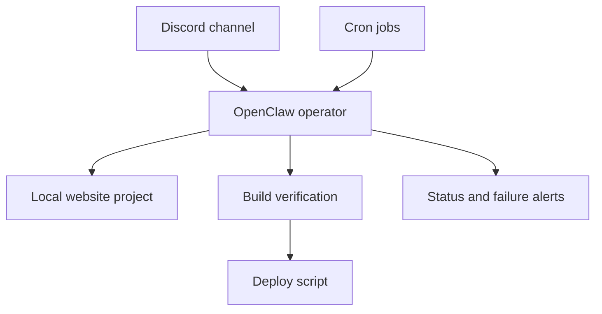

# OpenClaw Discord Website Operator Playbook

An anonymized, Mac-first playbook for building a reliable OpenClaw website operator that works through Discord, uses cron for scheduling, and safely updates production websites.

## What This Repo Covers

This repo documents a real operator workflow that was built and debugged on macOS. The operator is designed to:

- receive work through Discord
- inspect and update a website project locally
- run build verification before claiming success
- deploy to production through a guarded publish script
- use cron for recurring planning and timed publishing

This is both:

- a case study showing the failures, constraints, and fixes
- a playbook that helps other builders recreate a similar setup on macOS

## What Is Anonymized

The public version keeps the operator pattern and the lessons, but removes:

- client and project identities
- production domains
- real Discord or Telegram identifiers
- tokens, API keys, OAuth values, and auth profiles
- private screenshots and raw transcripts
- personal machine paths and unnecessary deploy details

## Why This Exists

The original setup was not reliable at first. The operator looked capable on paper, but in practice it had problems with:

- tool execution from Discord
- approval and runtime behavior
- overly chatty or misleading responses
- scheduling responsibilities being split across the wrong layers

The system became useful only after the runtime was stabilized, the publishing workflow was narrowed, and the scheduling model was cleaned up.

## What You Will Learn

- how to think about Discord as an operator surface rather than just a chat channel
- how to structure a guarded website publishing workflow
- where cron should own scheduling instead of live chat sessions
- how to reduce the difference between "sounds helpful" and "actually works"
- how to sanitize a real setup before sharing it publicly

## Architecture At A Glance

## Reading Order

1. [Case Study](./docs/case-study.md)
2. [Architecture](./docs/architecture.md)
3. [Mac Setup](./docs/mac-setup.md)
4. [OpenClaw Setup](./docs/openclaw-setup.md)
5. [Discord Setup](./docs/discord-setup.md)
6. [Scheduling and Cron](./docs/scheduling-and-cron.md)
7. [Security and Redaction](./docs/security-and-redaction.md)
8. [Lessons Learned](./docs/lessons-learned.md)

## Repo Map

- [`docs/`](./docs)
  - narrative, architecture, setup, security, and lessons
- [`sanitized-config/`](./sanitized-config)
  - example configuration files with placeholders only
- [`prompts/`](./prompts)
  - reusable prompt patterns for research, drafting, image prompting, publishing, and cleanup
- [`templates/`](./templates)
  - payload, approval, publish, and incident templates
- [`artifacts/`](./artifacts)
  - sanitized supporting evidence

## Security Note

This repo is meant to be reproducible, but not reckless. It intentionally omits the private values required to run a production setup. Read [Security and Redaction](./docs/security-and-redaction.md) before copying any pattern into a live environment.

## Current Status

This public version focuses on the macOS path. Future iterations may add broader cross-platform notes, but the validated setup described here is Mac-first by design.
