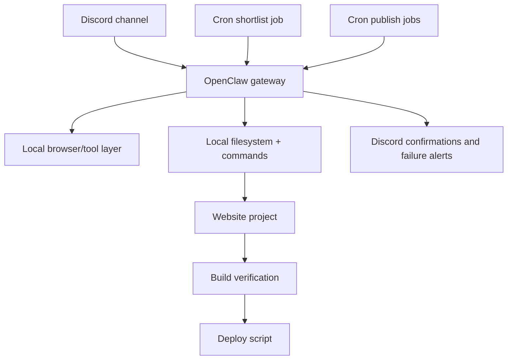

# Architecture

## Overview

This operator has four main layers:

1. Discord as the operating surface
2. OpenClaw as the local execution layer
3. Cron as the scheduling layer
4. A guarded website publishing workflow as the deployment layer

## System Diagram

## Channel Layer

Discord is the human-facing control surface. It is where the operator:

- receives research requests
- receives article approvals
- reports build verification
- confirms publishes
- sends failure alerts

It is not the right place to hold durable scheduling logic by itself.

## Operator Layer

OpenClaw handles:

- reading files
- running commands
- following workflow instructions
- interacting with the project on the local machine

The key design goal is to keep the operator exact. It should not claim it has done something unless the tool output proves it.

## Scheduling Layer

Cron is used for recurring or delayed work such as:

- weekly idea research
- timed publishing runs
- repeating failure alerts

This separation matters because live chat sessions are transient, but scheduled jobs need durability.

## Website Publishing Layer

The website workflow is intentionally narrow. In the working pattern described here, normal publishing should focus on:

- preparing a local `.webp` image
- editing the article data file
- running a build
- deploying through a single controlled script

That boundary prevents the operator from making unnecessary toolchain edits during routine publishing.

## Approval Boundary

A healthy operator separates:

- planning
- editing
- verification
- deployment

The system described in this repo works best when each step is explicit and build verification happens before any success claim.
